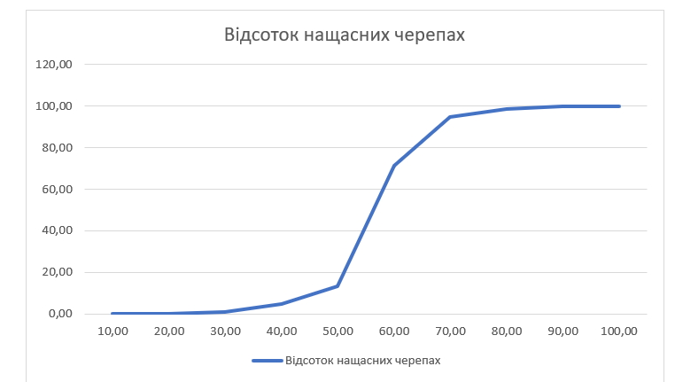
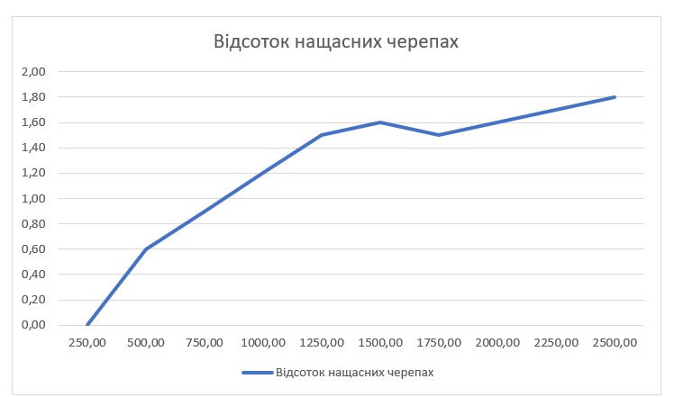
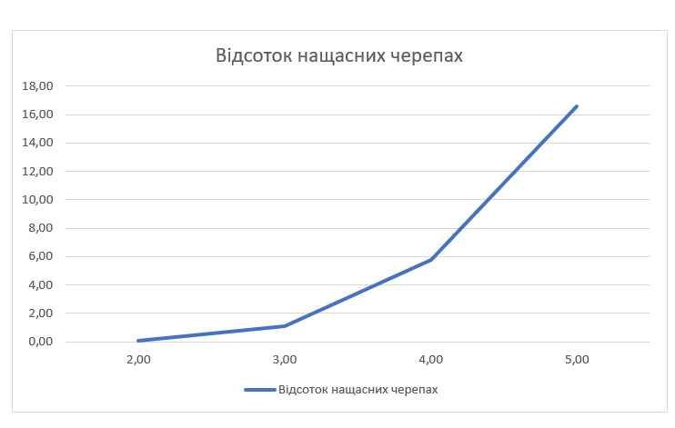

## Комп'ютерні системи імітаційного моделювання

## СПм-22-6, **Зубко Іван Сергійович**

### Лабораторна робота №**1**. Опис імітаційних моделей та проведення обчислювальних експериментів

 

### Варіант 8, модель у середовищі NetLogo:

[Segregation Simple Extension 1](http://www.netlogoweb.org/launch#http://www.netlogoweb.org/assets/modelslib/IABM%20Textbook/chapter%203/Segregation%20Extensions/Segregation%20Simple%20Extension%201.nlogo)

 

### Вербальний опис моделі:
Ця модель імітує черепах різних етнічних груп у ставку, розширюючи модель простої сегрегації. Користувачі керують такими параметрами, як загальна кількість черепах, етнічна приналежність та бажані сусіди одного кольору. Нещасливі черепахи рухаються до схожих сусідів, щоб удовольнити своє бажання бути поруч із подібними черепахами.

### Керуючі параметри:
- **number**. Цей показник визначає загальну кількість черепах, які будуть розміщені біля ставу під час налаштування.
- **%-similar-wanted**. Цей параметр визначає відсоток сусідів того самого виду, якого кожна черепаха прагне мати навколо себе. 
- **number-of-ethnicities**. Цей параметр визначає кількість різних видів черепах у популяції, призначених для представлення різних етнічних груп.
  
### Внутрішні параметри:
-   **percent-similar**. Цей параметр відображає середній відсоток однокольорових сусідів для кожної черепахи. 
-   **percent-unhappy**. Цей показник відображає відсоток черепах, які мають менше однокольорових сусідів, ніж вони бажають, і тому виражають бажання змінити своє розташування.
-   **happy?**. Для кожної черепахи цей показник вказує, чи має вона принаймні бажаний відсоток сусідів того самого кольору.
-   **similar-nearby**. Цей показник вказує, скільки сусідніх патчів мають черепах такого ж кольору.
-   **total-nearby**. Цей показник вказує, скільки сусідніх патчів має черепах будь яких кольорів.

### Показники роботи системи:
-    Графік, що відображає середній відсоток сусідів того самого кольору для кожної черепахи. Початкове значення наближене до 0,5, оскільки кожна черепаха (у середньому) має однакову кількість різнокольорових сусідів.
-   Графік, що відображає відсоток черепах, які мають менше сусідів своєї етнічної групи, ніж вони бажають, і, отже, виражають бажання змінити своє місце проживання.

### Примітки:
- Під час запуску черепахи розташовуються випадковим чином у ставку, але багато з них вважають себе "незадоволеними", не знаходячи достатньо сусідів своєї етнічної групи. Незадоволені черепахи переселяються, порушуючи баланс у популяції та спонукуючи інших також переселятись.
- Згодом кількість незадоволених черепах зменшується. Проте, ставок стає відокремленим, з формуванням кластерів кожної етнічної групи. Цей процес ілюструє, як юажання кожної черепахи впливає на глобальні патерни.

### Недоліки моделі
Модель в даному випадку передбачає сталі вподобання черепах до певного відсотку сусідів свого кольору. Додавання динамічності цьому параметру, яка змінюється з часом або від різних умов, дозволило б краще відтворювати зміну ставлення черепах до оточуючих. Також модель не враховує можливість конкуренції між різними етнічними групами черепах. У природі взаємодія між різними популяціями може включати конкуренцію за ресурси, але цей аспект відсутній у розглядуваній моделі.

 

## Обчислювальні експерименти
### 1. Вплив відсотку бажаних сусідів того самого виду на відсоток нащасних черепах
Досліджується залежність відсотка нащасних черепах від відсотку бажаних сусідів того самого виду протягом 10 тактів, вони дуже швидко переміщаються.
Експерименти проводяться при 10-100 відсотку бажаних сусідів, з кроком 10, усього 10 симуляцій.
Інші керуючі параметри мають значення за замовчуванням:
- **number**: 2000
- **number-of-ethnicities**: 3

<table>
<thead>
<tr><th>Відсоток бажаних сусідів того самого виду</th><th>Відсоток нащасних черепах</th></tr>
</thead>
<tbody>
<tr><td>10</td><td>0,0</td></tr>
<tr><td>20</td><td>0,2</td></tr>
<tr><td>30</td><td>0,8</td></tr>
<tr><td>40</td><td>4,6</td></tr>
<tr><td>50</td><td>13,5</td></tr>
<tr><td>60</td><td>71,1</td></tr>
<tr><td>70</td><td>94,6</td></tr>
<tr><td>80</td><td>98,7</td></tr>
<tr><td>90</td><td>99,8</td></tr>
<tr><td>100</td><td>99,8</td></tr>
</tbody>
</table>

)

Графік наочно показує, що відсоток бажаних однокольорових сусідів має значний вплив на щастя черепах. Але цікаво, що коли бажання черепах занадто високі, більше 70%, то черепахи майже ніколи не знайдуть гарного місця для життя.

### 2. Вплив кількості черепах на  відсоток нащасних черепах
Досліджується залежність відсотка нащасних черепах від кількості черепах протягом 10 тактів, вони дуже швидко переміщаються.
Експерименти проводяться при 250-2500 черепах, з кроком 250, усього 10 симуляцій.
Інші керуючі параметри мають значення за замовчуванням:
- **%-simular-wanted**: 30
- **number-of-ethnicities**: 3

<table>
<thead>
<tr><th>Кількість черепах</th><th>Відсоток нащасних черепах</th></tr>
</thead>
<tbody>
<tr><td>250</td><td>0,0</td></tr>
<tr><td>500</td><td>0,6</td></tr>
<tr><td>750</td><td>0,9</td></tr>
<tr><td>1000</td><td>1,2</td></tr>
<tr><td>1250</td><td>1,5</td></tr>
<tr><td>1500</td><td>1,6</td></tr>
<tr><td>1750</td><td>1,5</td></tr>
<tr><td>2000</td><td>1,6</td></tr>
<tr><td>2250</td><td>1,7</td></tr>
<tr><td>2500</td><td>1,8</td></tr>
</tbody>
</table>

Графік наочно показує, що існує слабка, проте позитивна залежність між кількістю черепах та відсотком незадоволених особин. При великій кількості черепах може виникати більше випадків, коли окремі особини вважають себе незадоволеними через вибірковість їхніх сусідів.

### 3. Вплив кількості видів черепах на відсоток нащасних черепах
Досліджується залежність відсотка нащасних черепах від кількості видів черепах протягом 10 тактів, вони дуже швидко переміщаються..
Експерименти проводяться при 2-5 видах, з кроком 1, усього 4 симуляцій.
Інші керуючі параметри мають значення за замовчуванням:
- **number**: 2000
- **%-simular-wanted**: 30

<table>
<thead>
<tr><th>Кількість видів черепах</th><th>Відсоток нащасних черепах</th></tr>
</thead>
<tbody>
<tr><td>250</td><td>0,1</td></tr>
<tr><td>500</td><td>1,1</td></tr>
<tr><td>750</td><td>5,8</td></tr>
<tr><td>1000</td><td>16,6</td></tr>
</tbody>
</table>

Графік наочно показує, що введення більшої різноманітності в видовий склад популяції призводить до більшого відсотка особин, які вважають себе незадоволеними внаслідок їхніх сусідів.

 
