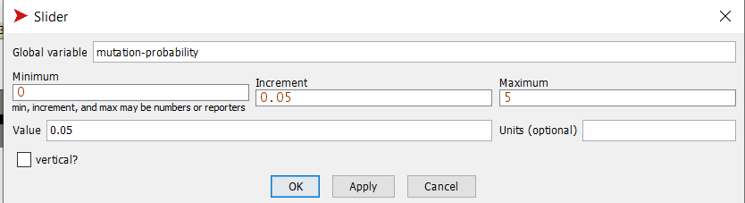
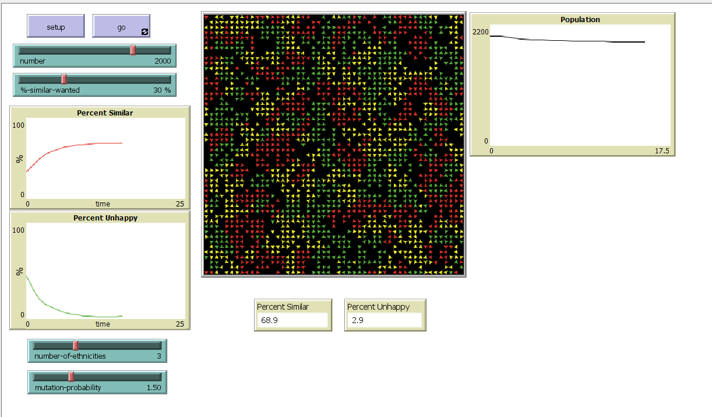
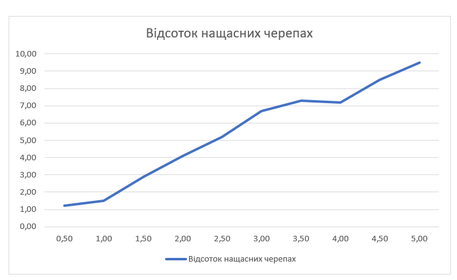

## Комп'ютерні системи імітаційного моделювання
## СПм-22-6, **Зубко Іван Сергійович**
### Лабораторна робота №**2**. Редагування імітаційних моделей у середовищі NetLogo

### Варіант 8, модель у середовищі NetLogo:

[Segregation Simple Extension 1.](http://www.netlogoweb.org/launch#http://www.netlogoweb.org/assets/modelslib/IABM%20Textbook/chapter%203/Segregation%20Extensions/Segregation%20Simple%20Extension%201.nlogo)

### Внесені зміни у вихідну логіку моделі, за варіантом:

**Додати можливість агенту зникнути, вірогідність чого залежить від кількості наявних поряд з ним "чужих" і кількості представників їхньої групи** 

Додано нову змінну під назвою "disappear-probability", щоб представити ймовірність зникнення агента.
<pre>
  turtles-own [
  disappear-probability
  ]
</pre>

Оновлено процедуру «go», щоб перевірити цю ймовірність і відповідно видалити агентів. Ось оновлений код:
<pre>
  to go 
  ...
    ask turtles [
    if random-float 1.0 < disappear-probability [die]
    ]
  ...
  end
</pre>

Додано залежність ймовірності зникнення від кількості «чужих» і кількості представників своєї групи у власному оточенні. Для цього модифіковано процедуру «update-turtles». Ось оновлений код:
<pre>
  to update-turtles
  ask turtles [
    set similar-nearby count (turtles-on neighbors) with [color = [color] of myself]
    set total-nearby count (turtles-on neighbors)
    set happy? similar-nearby >= ( %-similar-wanted * total-nearby / 100 )
    
    ;; calculate the ratio of strangers to representatives in the environment
    let strangers count (turtles-on neighbors) with [color != [color] of myself]
    let representatives count (turtles-on neighbors) with [color = [color] of myself]
    let ratio strangers / representatives
    
    ;; update the disappear-probability based on the ratio
    set disappear-probability ratio * (1 - happy? / 100)
  ]
end
</pre>

**Виводити графік зміни розміру популяції.**
Додано графік, що показує, як змінюється розмір населення ставка.

### Внесені зміни у вихідну логіку моделі, на власний розсуд:

**Додано мутацію черепах до моделі?**
Введено невелику ймовірність для кожної черепахи випадково змінити свій колір. Це додало симуляції елемент випадковості та різноманітності.

Додано слайдер, який відповідає за зміну ймовірності мутації.

Модифіковано процедуру «update-turtles». З деякою невеликою ймовірністю, яку виставить користувач, черепаха змінить свій колір а один з доступних кольорів.
<pre>
   to update-turtles
   ask turtles [
    if random-float 1.0 < disappear-probability [die]
    if random-float 100.0 < mutation-probability [set color (item (random number-of-ethnicities) colors)]
   ]
   end
</pre>

Фінальний код моделі та її інтерфейс доступні за [посиланням](Segregation.nlogo). 
 
  
## Обчислювальні експерименти
### 1. Вплив ймовірності мутації на відсоток нащасних черепах
Досліджується залежність відсотка нащасних черепах від ймовірності мутації протягом 15 тактів.
Експерименти проводяться при 0.5-5% ймовірності мутації, з кроком 0.5, усього 10 симуляцій.  
Інші керуючі параметри мають значення за замовчуванням:
-   **number**: 2000;
-   **%-simular-wanted**: 30;
-   **number-of-ethnicities**: 3;

<table>
<thead>
<tr><th>Ймовірності мутації</th><th>Відсоток нащасних черепах</th></tr>
</thead>
<tbody>
<tr><td>0.5</td><td>1,2</td></tr>
<tr><td>1.0</td><td>1,5</td></tr>
<tr><td>1.5</td><td>2,9</td></tr>
<tr><td>2.0</td><td>4,1</td></tr>
<tr><td>2.5</td><td>5,2</td></tr>
<tr><td>3.0</td><td>6,7</td></tr>
<tr><td>3.5</td><td>7,3</td></tr>
<tr><td>4.0</td><td>7,2</td></tr>
<tr><td>4.5</td><td>8,5</td></tr>
<tr><td>5.0</td><td>9,5</td></tr>
</tbody>
</table>

Графік наочно показує, що зростання ймовірності мутації призводить до збільшення відсотку нащасних черепах. Черепахи стають нещасливими при збільшенні ймовірності мутації, оскільки мутація впливає на колір черепах та порушує умову для їхнього щастя, яка полягає в тому, щоб мати однокольорових сусідів.
