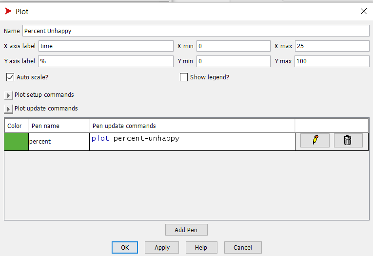
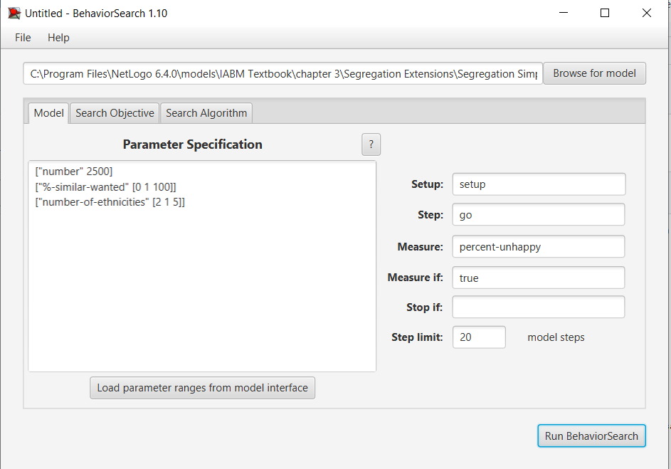
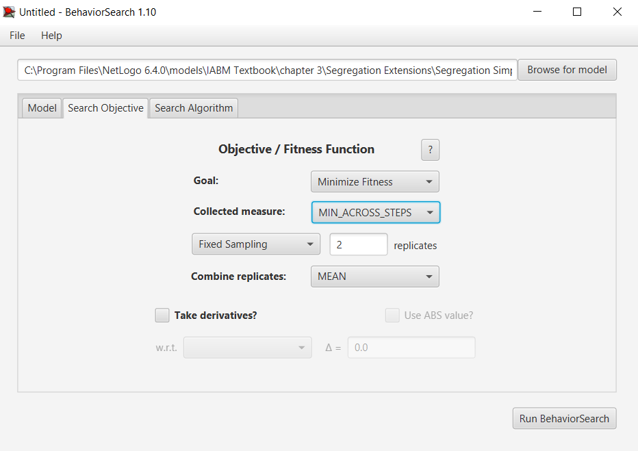
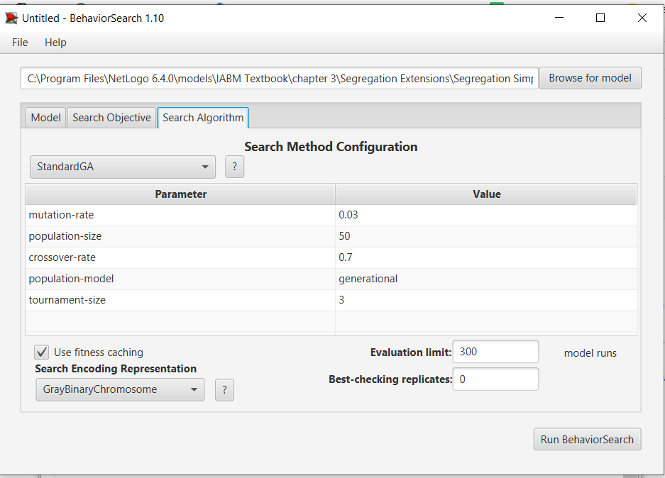
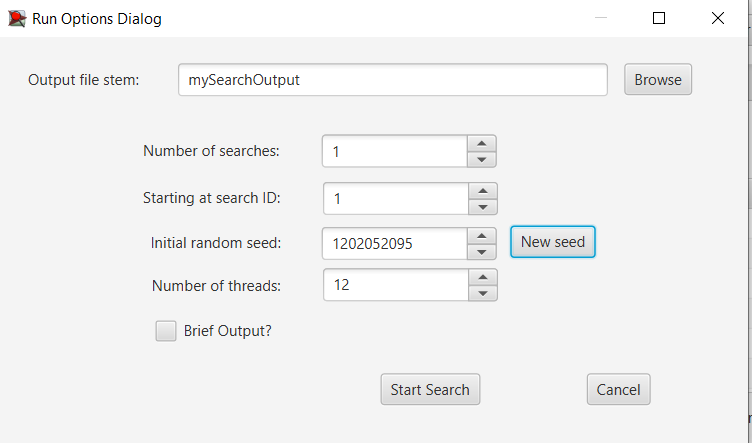
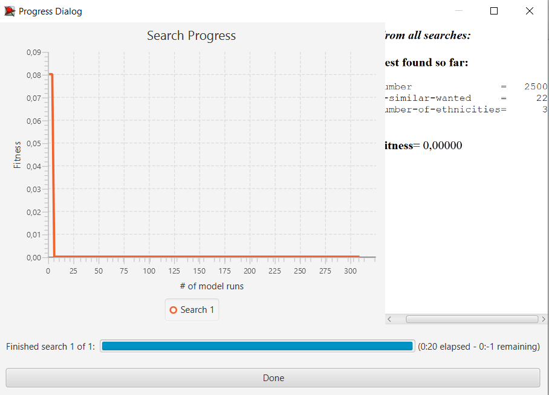
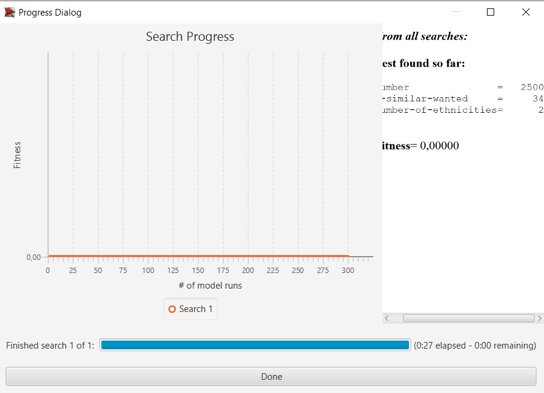

## Комп'ютерні системи імітаційного моделювання
## СПм-22-6, **Зубко Іван Сергійович**
### Лабораторна робота №**3**. Використання засобів обчислювального интелекту для оптимізації імітаційних моделей

 

### Варіант 8, модель у середовищі NetLogo:

[Segregation Simple Extension 1](http://www.netlogoweb.org/launch#http://www.netlogoweb.org/assets/modelslib/IABM%20Textbook/chapter%203/Segregation%20Extensions/Segregation%20Simple%20Extension%201.nlogo)

### Налаштування середовища BehaviorSearch:
**Обрана модель**:
<pre>
C:\Program Files\NetLogo 6.4.0\models\IABM Textbook\chapter 3\Segregation Extensions\Segregation Simple Extension 1.nlogo
</pre>

**Параметри моделі** (вкладка Model):
<pre>
["number" 2500]
["%-similar-wanted" [0 1 100]]
["number-of-ethnicities" [2 1 5]]
</pre>

Використовувана **міра**:  
Для фітнес-функції було обрано **значення відсотка нещасливих черепах**, вираз для її розрахунку взято з налаштувань графіку аналізованої імітаційної моделі в середовищі NetLogo  
  
та вказано у параметрі "**Measure**":
<pre>
percent-unhappy
</pre>
Середній відсоток нещасливих черепах повиннен враховуватися **в середньому** за весь період симуляції тривалістю, 20 тактів , починаючи з 0 такту симуляції.  
Параметр зупинки за умовою ("**Stop if**") у разі не використовувався.  
Загальний вигляд вкладки налаштувань параметрів моделі:  

**Налаштування цільової функції** (вкладка Search Objective):  
Метою підбору параметрів імітаційної моделі, що моделює черепах різних видів в ставі - є **мінімізація** відсотка нещасливих черепах – це вказано через параметр "**Goal**" зі значенням **Minimize Fitness**. При цьому цікавить не просто значення нещасливих черепах, а її мінімальне значення протягом всієї симуляції (тривалість якої (20 тактів) вказувалася на минулій вкладці). Для цього у параметрі "**Collected measure**", що визначає спосіб обліку значень обраного показника, вказано **MIN_ACROSS_STEPS**.
Щоб уникнути викривлення результатів через випадкові значення, що використовуються в лозіці самої імітаційної моделі, **кожна симуляція повторюється по 2 рази**, результуюче значення розраховується як **середнє арифметичне**.
Загальний вигляд вкладки налаштувань цільової функції:

**Налаштування алгоритму пошуку** (вкладка Search Algorithm):
Загальний вид вкладки налаштувань алгоритму пошуку:

 

### Результати використання BehaviorSearch:

Діалогове вікно запуску пошуку *(можна залишити за замовчуванням, але стежте, куди пишеться результат)*:

Результат пошуку параметрів імітаційної моделі, використовуючи **генетичний алгоритм**:  

Результат пошуку параметрів імітаційної моделі, використовуючи **випадковий пошук**:  

